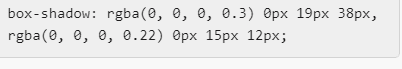

# CHANELS CAUSE WEBSITE
Chanel’s Cause is a none for profit aiming to raise awareness and funds for children affected by Congenital Heart Defects. In addition, they have a support group called Heart Family Group and fund raise annually for their Christmas Campaign, taking gifts into Children’s Hospital wards on Christmas Eve.
# User Experience (UX)
## Project Goals
The project goals are to create a website that can be used to:
* Spread Awareness on CHD (Congenital Heart Defects).
* Provide information on Heart Family Group (support group for people directly affected by CHD).
* Provide information and pictures on the Christmas Campaign.
* links to Chanels social media and just giving page.
* links to Heart Family Group for people needing support. 
* good explanation on what Chanels Cause is all about.
## First Time Visitor
* Easily navigate threw the site and to all the external links.
* Find it easy to understand what the website is all about.
## Returning Visitor
* Find and access the support group and any fundraising activities are coming up.
* Be able to get in contact.

# Design

## Fonts where used from google fonts. View There website [here](https://fonts.google.com/).
* Font name = Oxygen (Designed by Vernon Adams) was used as the main texting style.
* Font name = Dancing Script was used in headers.

## Icons
All icons came from Font Awesome. View there website [here](https://fontawesome.com/).
* Facebook
* Twitter
* Instagram
* Donate

## Colours
* We matched the Chanels Cause logo to a deep red #ca041a what we used for the nav, footer and some heading elements.
* Black was used for the min text and also hover because it looked nice against the red.
* #fafafa was used as the text in the nav bar to stand out against the red but also be very subtle.
* #e8dac7 was used as the main background color for all the sections. 

## Videos
Two videos where used in this project,
1. Home page video is all about Chanels condition and what Chanels Cause is all about.
2. Heart Family Group page video is collaboration from Heart Family Group members to show support to each other.

## Images
1. Banner
    * Banner was created in photoshop.
2. Images
    * All 9 images on the Christmas Campaign where too from mobile devices and are all my own.

## Wire frames
#### Desktop wire frames
* Home page [view](https://github.com/Micheal-Murrish/Chanels-Cause/blob/main/Wireframes/Wireframe-home-desktop.png).
* Christmas Campaign [view](https://github.com/Micheal-Murrish/Chanels-Cause/blob/main/Wireframes/Wireframe-cc-desktop.png).
* Heart Family Group [view](https://github.com/Micheal-Murrish/Chanels-Cause/blob/main/Wireframes/Wireframe-hfg-desktop.png).
* Contact [view](https://github.com/Micheal-Murrish/Chanels-Cause/blob/main/Wireframes/Wireframe-contact-desktop.png).
#### Mobile Wire frame
* Mobile Version [view](https://github.com/Micheal-Murrish/Chanels-Cause/blob/main/Wireframes/Wireframe%20mobile.png).
#### Tablet Wire frame
* Tablet Version [view](https://github.com/Micheal-Murrish/Chanels-Cause/blob/main/Wireframes/Wireframe%20Tablet.png).

# Features
* Internal links navigating threw the website for a easy user experience.
* External links opening in a new and navigating to the exact requested address.
* Hover affects to show what link you are picking and also what page you are on currently.
* Responsive on all devices.
* Contact form.
* Two videos.
    1. Video on home page explaining Chanels Cause
    2. Video on Heart Family Group Page was a collaboration from members of the group. 
* Images used from over the years to showcase the work we do.

# Languages Used
1. [HTML5](https://en.wikipedia.org/wiki/HTML5).
2. [CSS3](https://en.wikipedia.org/wiki/CSS).

# Programs and Libraries Used
1. [Gitpod](https://www.gitpod.io/)
    * GitPod was the workspace used to write all the code.
2. [GitHub](https://github.com/)
    * GitPod was used to add/commit/push my code onto, to keep a hard save/backup.
3. [Google fonts](https://fonts.google.com/)
    * Google Fonts is where i got the fonts "Oxygen" for the main text and "Dancing Script" for headers.
4. [Font Awesome](https://fontawesome.com/)
    * Font Awesome ws used to get the icons for all the social media in the footer.
5. [Balsamiq](https://balsamiq.com/)
    * Balsamiq was used for the wireframes.
6. [Adobe Photoshop](https://www.adobe.com/uk/)
    * Photoshop was used to create the banner, with the text on the right and the logo on the left.

# External Website References
1. [Wikipedia](https://en.wikipedia.org/wiki/Hypoplastic_left_heart_syndrome)
    * Wikipedia was used to access more infomtion on the Word Hypoplastic Left Hear Syndrome.
2. [Guinness World Records](https://www.guinnessworldrecords.com/news/2015/6/1-minute-old-baby-is-youngest-open-heart-surgery-patient-ever-385925)
    * Guinnes World Records was used to in a link to take you to Chanels Record page.
3. [CHUF](https://www.chuf.org.uk/about/heart-heroes/)
    * CHUF (childrens heart unit freemans hospital) was used because they have done alot of work for and with Chanel.
4. [British Heart Foundation](https://www.bhf.org.uk/)
    * British Heart Foundation was used because they ahve done alot of work for and with Chanel.
5. [Facebook](https://en-gb.facebook.com/)
    * Social media Platform
6. [Twitter](https://twitter.com/?lang=en)
    * Social media Platform    
7. [Instagram](https://www.instagram.com/)
    * Social media Platform
8. [GoFundMe](https://www.gofundme.com/)
    * GoFundMe is a platform to collect donations and is linked to the Donate link on the footer.
# Testing   
### HTML AND CSS Testing.
1. [W3C Markup Validator](https://validator.w3.org/) for the HTML
2. [W3C CSS Validator](https://jigsaw.w3.org/css-validator/) for the CSS.

All issues foud where fixed apart from on the CSS, i was getting this error message"Imported style sheets are not checked in direct input and file upload modes" and upon investigation i found it to be that W3C just wont validate the imported style sheets.
### Website testing
* The website was tested in Google Crome and Microsoft Edge.
* The website has been tested on desktop, laptop, ipad and mobile devices.
* All links have been tested to ensure they direct the user to the correct place.
### Lighthouse Test
I also used Lighthouse Testing in Dev Tools on chrome and these where the results for Desktop and Mobile.

Desktop

Mobile

## User Experience Testing

### First Time Visitor
1. Easily navigate threw the site and to all the external links.
    * All links have a hover effect put on them and alos a change in the cursor to indicate a clickable link.
2. Find it easy to understand what the website is all about.
    * The website has links to external information sorces, and lots of internal iformation on what the website is about and what Chanels Cause actualy does.
### Returning Visitor
1. Find and access the support group and any fundraising activities are coming up.
    * The site has links to The Heart Family Group where people will be directed to and be able to sign up.
2. Be able to get in contact.
    * There is a contact me form.

## Known bugs/issues

1. Nav bar and banner image shrink with screen size making it look two small on mobile devices.
2. My mentor pointed out my git commit messages where not good enough, i understand now and will make them more specific in the future

## Problems I could not solve
1. Tried to add a sticky nav bar so you could access the nav without scrolling up the page.
    * For some reason it just never worked, i tried stack overflow and also watched Youtube videos on the subject but still got no further forward.
2. Tried to add a hamburger menu for mobile platform for the nav bar
    * My mentor showed me a way to implement a hamburger menu for mobile devices, ws a very good idea and something i will add later, but i could not get it to look nice on my site, maybe after the JavaScript side of the course it will make more sence.

# Deployment

## GitHub Pages

Chanels Cause Website was deployed to GitHub pages using the following steps.
1. Log into GitHub and navagate to Your Repositories and Choose [Chanels-Cause](https://github.com/Micheal-Murrish/Chanels-Cause)
2. Navigate to Settings then down to Pages.
3. Find Source and select Main-Branch
4. The page will automatically refresh
5. Scroll back down the page and it will display published your site [https://micheal-murrish.github.io/Chanels-Cause/index.html](https://micheal-murrish.github.io/Chanels-Cause/index.html)

## GitHub Forking
1. Log in to GitHub and locate [Chanels-Cause](https://github.com/Micheal-Murrish/Chanels-Cause)
2. Locate the Fork button in the top right and that should add the repository to your GitHub account.

## Download Files
1. Log in to GitHub and locate [Chanels-Cause](https://github.com/Micheal-Murrish/Chanels-Cause)
2. Find the Code Buton and select the Download Zip from the menu.

# Credits
## Code

* Suzybee_lead suggested background shadows for all the 9 images on the Christmas Campaign page and i copied and pasted the box-shadows refrence she suggested and it looked very good so I kept it in.

* Going back threw all the content I had done with Code Institute was huge help in re-joggimg my memory for most small issues i was having.
## Content and Media
* All content was written by the Developer.
* All images are owned by the Developer.
* All videos are owned by the Developer
## Acknowledgements
* Tutor and Student Support is amazing and everyone is always willing to help.
* My Mentor worked very hard in helping understand the process alot better.

